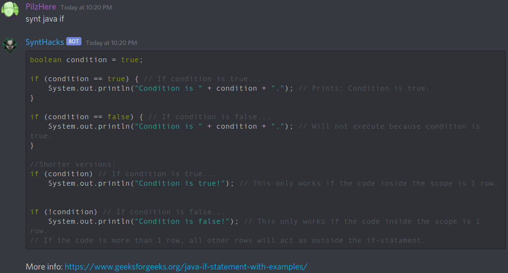

# SyntHacks

	
 
A bot for discord. 
Ask and you shall recieve syntax or other relevant information.

### Usage examples
*synt java if*
*synt c versions*

### Setup
  1. In terminal, cd to project root folder: *npm install discord.js* 
  2. Create file *token.txt* in project root folder and paste your own token there. <b>Make sure it is only 1 line.</b>
