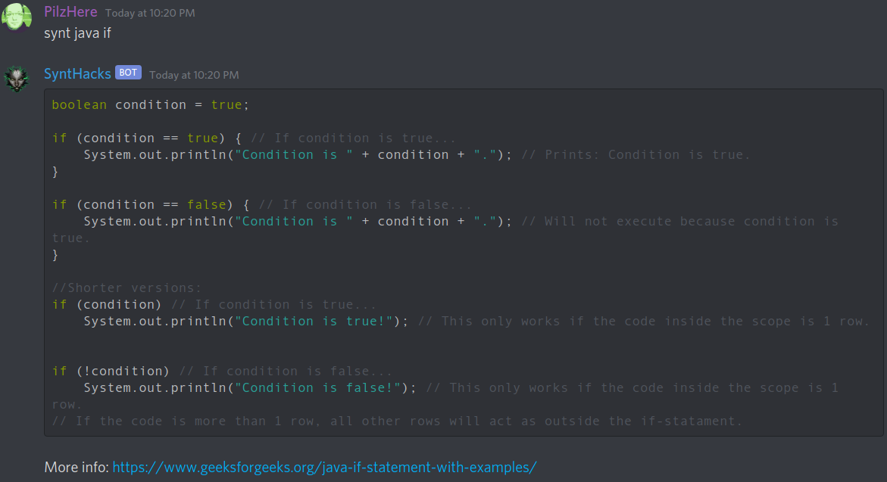

# SyntHacks

	
 
A bot for Discord chat application that displays code syntax and other relevant information for programming languages.

### Usage examples
*synt help* 
*synt java words*  
*synt java if* 
*synt java for-loop* 
*synt c versions*

### Setup
  1. In terminal, cd to project root folder: *npm install discord.js* 
  2. Create file *token.txt* in project root folder and paste your own token there. <b>Make sure it is only 1 line.</b>
